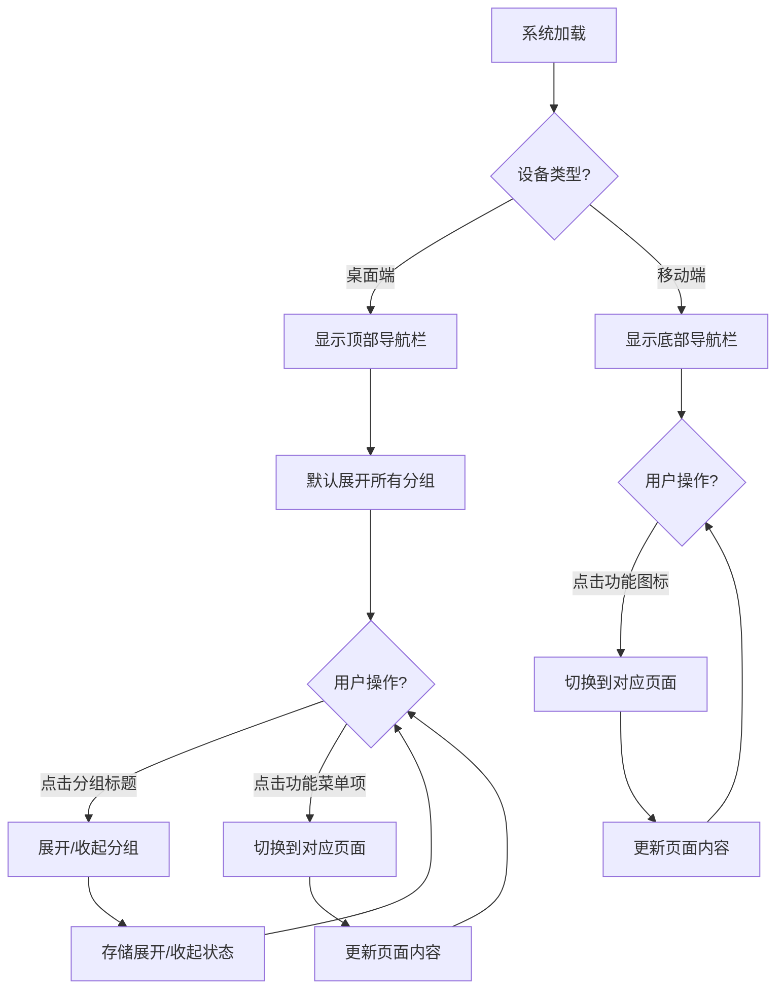

# 多层级可展开导航结构设计PRD

## 1. 产品概览

本PRD旨在设计和实现一个多层级可展开的导航结构，用于翡翠进销存管理系统，以提供更清晰、更高效的功能导航体验。

- 解决当前导航结构在功能模块增多时的展示和管理问题，通过分层结构提高导航的可扩展性和用户体验。
- 目标是创建一个具有良好视觉层次、流畅交互效果和响应式设计的导航系统，适配不同设备和屏幕尺寸。

## 2. 核心功能

### 2.1 功能模块

| 模块名称 | 功能描述 | 优先级 |
|---------|---------|--------|
| 多层级导航结构 | 支持多级功能分组和展开/收起 | 高 |
| 功能场景分组 | 按照业务场景对功能进行合理分类 | 高 |
| 展开/收起交互 | 提供流畅的展开/收起动画效果 | 高 |
| 响应式设计 | 适配桌面端、平板和移动端 | 高 |
| 状态记忆 | 记住用户的展开/收起状态 | 中 |
| 快捷键支持 | 保持现有的快捷键功能 | 中 |
| 视觉反馈 | 提供清晰的视觉提示和状态指示 | 中 |

### 2.2 页面详情

| 页面名称 | 模块名称 | 功能描述 |
|---------|---------|--------|
| 导航栏 | 多层级导航结构 | 实现可展开/收起的多层级导航菜单，支持至少两级深度 |
| 导航栏 | 功能场景分组 | 将系统功能按照业务场景进行合理分组，如核心业务、营销促销、数据分析等 |
| 导航栏 | 展开/收起交互 | 点击分组标题时，平滑展开/收起子菜单，带有过渡动画效果 |
| 导航栏 | 响应式设计 | 在桌面端显示顶部导航栏，在移动端显示底部导航栏，自动适应屏幕尺寸 |
| 导航栏 | 状态记忆 | 使用localStorage存储用户的展开/收起状态，刷新页面后保持状态 |
| 导航栏 | 快捷键支持 | 保持现有的数字键和Alt+数字键切换标签页的功能 |
| 导航栏 | 视觉反馈 | 为当前激活的菜单项提供明显的视觉指示，包括颜色和位置变化 |

## 3. 核心流程

### 3.1 桌面端导航流程

1. 用户打开系统，看到顶部导航栏，默认展开所有功能分组
2. 用户可以点击分组标题旁边的展开/收起图标，或直接点击分组标题，来展开或收起该分组
3. 展开/收起操作带有平滑的动画效果
4. 用户点击具体的功能菜单项，切换到对应页面
5. 系统记录用户的展开/收起状态，下次打开时保持该状态

### 3.2 移动端导航流程

1. 用户打开系统，看到底部导航栏，显示常用功能的图标
2. 移动端导航保持现有的底部固定栏设计，确保操作便捷性
3. 用户点击图标切换到对应页面



## 4. 用户界面设计

### 4.1 设计风格

- 主色调：保持现有的翡翠绿色主题（emerald-600）
- 辅助色：使用中性色调（如gray系列）作为背景和文本颜色
- 按钮样式：采用圆角设计，hover效果平滑过渡
- 图标：使用lucide-react提供的图标，保持风格一致
- 字体：使用系统默认字体，确保跨平台一致性
- 布局：采用卡片式布局，有明确的视觉层次

### 4.2 页面设计概览

| 页面名称 | 模块名称 | UI元素 |
|---------|---------|--------|
| 导航栏 | 多层级导航结构 | 顶部导航栏，高度60px，背景色为白色（或深色模式下的深色背景），带有轻微阴影 |
| 导航栏 | 功能场景分组 | 分组标题采用小字号（12px），灰色文本，hover时变为黑色（或深色模式下的白色） |
| 导航栏 | 展开/收起交互 | 分组标题左侧有展开/收起图标（ChevronDown/ChevronRight），点击时平滑过渡 |
| 导航栏 | 响应式设计 | 桌面端显示完整的顶部导航栏，移动端显示底部导航栏，在平板设备上自动适应 |
| 导航栏 | 状态记忆 | 无直接UI元素，通过localStorage存储状态 |
| 导航栏 | 快捷键支持 | 菜单项右侧显示快捷键提示（如Alt+1），仅在桌面端显示 |
| 导航栏 | 视觉反馈 | 当前激活的菜单项背景为浅绿色，文字为深绿色，带有轻微的阴影效果 |

### 4.3 响应式设计

- 桌面端（>1024px）：显示完整的顶部导航栏，支持多级展开/收起
- 平板端（768px-1024px）：显示顶部导航栏，可能需要调整菜单项间距
- 移动端（<768px）：显示底部导航栏，保持现有设计，确保操作便捷性

## 5. 功能场景分组设计

### 5.1 一级分组

| 分组名称 | 二级菜单 | 功能描述 |
|---------|---------|--------|
| 核心业务 | 库存管理 | 货品入库、出库和查询 |
| 核心业务 | 销售记录 | 销售数据和分析 |
| 核心业务 | 批次管理 | 批量采购和录入 |
| 核心业务 | 客户管理 | 客户信息和VIP体系 |
| 营销与促销 | 促销管理 | 促销活动创建和管理 |
| 库存优化 | 库存盘点 | 定期盘点和差异报告 |
| 库存优化 | 入货建议 | 智能入货推荐 |
| 数据分析 | 利润看板 | 销售统计和数据分析 |
| 系统管理 | 操作日志 | 系统操作记录查询 |
| 系统管理 | 系统设置 | 配置和数据管理 |

### 5.2 展开层级图

```
┌─────────────┐
│ 核心业务    │◄─── 展开/收起控制
├─────────────┤
│ ├ 库存管理  │
│ ├ 销售记录  │
│ ├ 批次管理  │
│ └ 客户管理  │
├─────────────┤
│ 营销与促销  │◄─── 展开/收起控制
├─────────────┤
│ └ 促销管理  │
├─────────────┤
│ 库存优化    │◄─── 展开/收起控制
├─────────────┤
│ ├ 库存盘点  │
│ └ 入货建议  │
├─────────────┤
│ 数据分析    │◄─── 展开/收起控制
├─────────────┤
│ └ 利润看板  │
├─────────────┤
│ 系统管理    │◄─── 展开/收起控制
├─────────────┤
│ ├ 操作日志  │
│ └ 系统设置  │
└─────────────┘
```

## 6. 实现方案

### 6.1 技术选型

- 前端框架：React 19 + TypeScript 5
- UI库：Tailwind CSS 4 + shadcn/ui
- 图标库：lucide-react
- 状态管理：Zustand
- 存储：localStorage（用于保存展开/收起状态）

### 6.2 核心实现

1. **数据结构设计**：
   - 使用嵌套对象或数组表示导航结构
   - 每个分组包含标题、图标、子菜单等信息

2. **展开/收起状态管理**：
   - 使用React useState管理展开/收起状态
   - 使用localStorage持久化存储状态

3. **动画效果**：
   - 使用Tailwind CSS的transition类实现平滑过渡
   - 为展开/收起操作添加适当的动画时长和缓动函数

4. **响应式设计**：
   - 使用Tailwind CSS的响应式类（如md:, lg:）
   - 在不同屏幕尺寸下显示不同的导航布局

5. **快捷键支持**：
   - 保持现有的数字键和Alt+数字键切换功能
   - 确保快捷键在展开/收起状态下依然有效

### 6.3 代码结构

```typescript
// 导航数据结构
const navGroups = [
  {
    id: 'core',
    title: '核心业务',
    icon: Briefcase,
    items: [
      { id: 'inventory', label: '库存管理', icon: Package, shortcut: 'Alt+2' },
      { id: 'sales', label: '销售记录', icon: ShoppingCart, shortcut: 'Alt+3' },
      { id: 'batches', label: '批次管理', icon: Layers, shortcut: 'Alt+4' },
      { id: 'customers', label: '客户管理', icon: Users, shortcut: 'Alt+5' },
    ]
  },
  // 其他分组...
];

// 展开/收起状态管理
const [expandedGroups, setExpandedGroups] = useState<Record<string, boolean>>(() => {
  // 从localStorage读取状态，默认全部展开
  const saved = localStorage.getItem('navExpandedState');
  return saved ? JSON.parse(saved) : navGroups.reduce((acc, group) => {
    acc[group.id] = true;
    return acc;
  }, {} as Record<string, boolean>);
});

// 保存状态到localStorage
useEffect(() => {
  localStorage.setItem('navExpandedState', JSON.stringify(expandedGroups));
}, [expandedGroups]);

// 展开/收起切换
const toggleGroup = (groupId: string) => {
  setExpandedGroups(prev => ({
    ...prev,
    [groupId]: !prev[groupId]
  }));
};
```

## 7. 测试计划

### 7.1 功能测试

| 测试项 | 预期结果 |
|-------|---------|
| 分组展开/收起 | 点击分组标题时，子菜单平滑展开/收起 |
| 功能菜单项点击 | 点击菜单项时，正确切换到对应页面 |
| 状态记忆 | 刷新页面后，保持之前的展开/收起状态 |
| 快捷键功能 | 使用数字键和Alt+数字键能正确切换页面 |
| 响应式适配 | 在不同屏幕尺寸下显示正确的导航布局 |

### 7.2 性能测试

| 测试项 | 预期结果 |
|-------|---------|
| 展开/收起动画 | 动画流畅，无卡顿 |
| 页面切换速度 | 点击菜单项后，页面切换响应迅速 |
| 内存使用 | 导航操作不会导致内存泄漏 |

### 7.3 兼容性测试

| 测试项 | 预期结果 |
|-------|---------|
| 浏览器兼容性 | 在主流浏览器（Chrome, Firefox, Safari, Edge）中正常工作 |
| 设备兼容性 | 在桌面端、平板和移动端设备上正常显示和操作 |

## 8. 上线计划

### 8.1 开发阶段

1. 实现多层级导航数据结构
2. 开发展开/收起交互功能
3. 添加动画效果
4. 实现响应式设计
5. 集成状态记忆功能
6. 测试所有功能

### 8.2 上线准备

1. 进行全面的功能测试
2. 收集用户反馈
3. 进行必要的调整和优化
4. 部署到生产环境

### 8.3 上线后

1. 监控系统运行状态
2. 收集用户反馈
3. 持续优化导航体验

## 9. 风险评估

| 风险项 | 影响程度 | 发生概率 | 应对措施 |
|-------|---------|---------|---------|
| 展开/收起动画卡顿 | 低 | 中 | 优化动画性能，使用CSS transitions而非JavaScript动画 |
| 状态记忆失效 | 低 | 低 | 提供默认展开状态，确保即使localStorage失效也能正常使用 |
| 响应式布局问题 | 中 | 中 | 充分测试不同屏幕尺寸，确保布局正确 |
| 快捷键冲突 | 低 | 低 | 确保快捷键只在适当的场景下触发，避免与其他功能冲突 |

## 10. 结论

本PRD设计的多层级可展开导航结构将为翡翠进销存管理系统提供更清晰、更高效的导航体验。通过合理的功能分组、流畅的展开/收起交互、美观的动画效果和响应式设计，将大大提高用户的操作效率和系统的可扩展性。

同时，通过状态记忆功能，用户可以根据自己的使用习惯定制导航结构，进一步提升用户体验。

该设计方案充分考虑了系统的现有架构和技术栈，确保了实现的可行性和一致性。