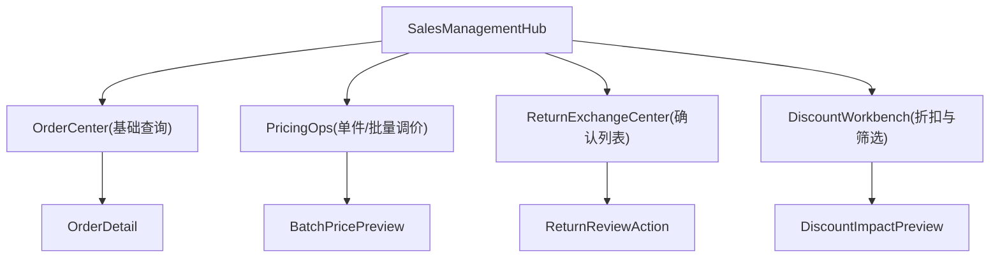

# 销售管理业务集合规划（仅规划不开发）

## 1) 本期冻结范围（上线稳定优先）

### 1.1 执行边界
- 本期仅处理已确认 bug，不新增业务功能代码。
- 销售管理集合能力仅输出产品与技术设计，不落运行逻辑。
- 现有核心接口契约冻结：
  - `src/app/api/sales/route.ts`
  - `src/app/api/sales/return/route.ts`
  - `src/app/api/sales/bundle/route.ts`
  - `src/app/api/items/route.ts`

### 1.2 变更准入规则
- 可做：需求文档、接口草案、数据草案、迭代排期。
- 不做：数据库迁移、API行为变化、前端交互改造、权限模型重构。

---

## 2) 销售管理业务集合（模块清单与信息架构）

## 2.1 模块清单
- 模块 A：销售订单中心（集合入口）
  - 保留现有“基础查询”能力（列表、详情、导出）。
  - 叠加“业务动作入口”，不改基础查询语义。
- 模块 B：单件/批量调价
  - 单件调价：手工价优先。
  - 批量调价：按筛选条件选中后批量应用。
- 模块 C：退换货确认列表
  - 与当前退货动作解耦：增加“待确认/已确认/已驳回”视图。
  - 支持按时间、状态、SKU、客户筛选追溯。
- 模块 D：折扣策略与筛选选品
  - 先设折扣规则，再按条件筛选（价格带、库龄带、器型销量）批量应用。

## 2.2 页面信息架构（草案）

---

## 3) 数据与接口草案（仅设计）

## 3.1 退换货确认列表

### 数据对象（建议）
- `return_case`（逻辑对象，初期可由 `sale_returns + sale_records + items` 视图拼装）
  - `case_no`
  - `sale_id`
  - `item_id`
  - `sku_code`
  - `customer_name`
  - `requested_refund_amount`
  - `review_status`（pending/approved/rejected）
  - `review_note`
  - `reviewed_by`
  - `reviewed_at`
  - `created_at`

### API 草案
- `GET /api/sales/returns/cases`
  - query: `status`, `start_date`, `end_date`, `keyword`, `page`, `size`
  - resp: `{ items, pagination, summary }`
- `POST /api/sales/returns/cases/{id}/approve`
- `POST /api/sales/returns/cases/{id}/reject`

## 3.2 单件/批量调价

### 数据对象（建议）
- `price_change_job`
  - `job_no`
  - `mode`（single/batch）
  - `target_count`
  - `rule_type`（fixed/percent/floor_based）
  - `rule_payload`
  - `dry_run_result`
  - `applied_by`
  - `applied_at`

### API 草案
- `POST /api/pricing/jobs/preview`
  - req: `filters`, `rule`
  - resp: `affected_items`, `price_diff_stats`, `risk_flags`
- `POST /api/pricing/jobs/confirm`
  - req: `job_token` or `filters+rule(hash)`
  - resp: `updated_count`, `failed_items`

## 3.3 折扣策略与筛选选品

### 筛选维度（你指定）
- 价格带：`price_min`, `price_max`
- 库龄带：`age_days_min`, `age_days_max`
- 器型销量：`type_sales_rank`, `type_sales_count_min`

### 折扣对象（建议）
- `discount_policy`
  - `policy_name`
  - `discount_type`（percent/fixed）
  - `discount_value`
  - `scope_filters`
  - `effective_start`, `effective_end`
  - `stacking_rule`
  - `status`

### API 草案
- `POST /api/discount/policies/preview`
  - req: `policy`, `filters`
  - resp: `affected_items`, `before_after_price`, `margin_delta`
- `POST /api/discount/policies/apply`
  - req: `policy_id | policy_payload`
  - resp: `applied_count`, `skipped_count`, `audit_id`

---

## 4) R1-R3 迭代路线与风险标注

## R1：退换货确认列表
- 目标：把“退货动作”升级为“可审计的确认流程”。
- 产出：确认列表、状态流转、追溯筛选。
- 与当前 bug 修复冲突风险：低（新增入口，不改现有销售查询逻辑）。

## R2：单件/批量调价
- 目标：建立稳定可回溯的调价流程，避免直接散点改价。
- 产出：预览->确认两阶段、变更日志、失败明细。
- 冲突风险：中（与现有 `items/batch-price` 能力可能重叠，需要收口）。

## R3：折扣策略与筛选选品
- 目标：先按业务条件筛选，再批量应用折扣，提供影响预览。
- 产出：规则配置、筛选器、影响评估、批量应用。
- 冲突风险：中高（影响毛利计算口径与看板统计定义）。

---

## 5) 验收标准（规划阶段）
- 范围清晰：每个模块有目标、边界、输入输出。
- 可实施：每个模块可独立排期开发与验收。
- 可控风险：每个模块有与当前上线修复的冲突等级说明。
- 不扰动上线：本期不引入运行时行为变更。
